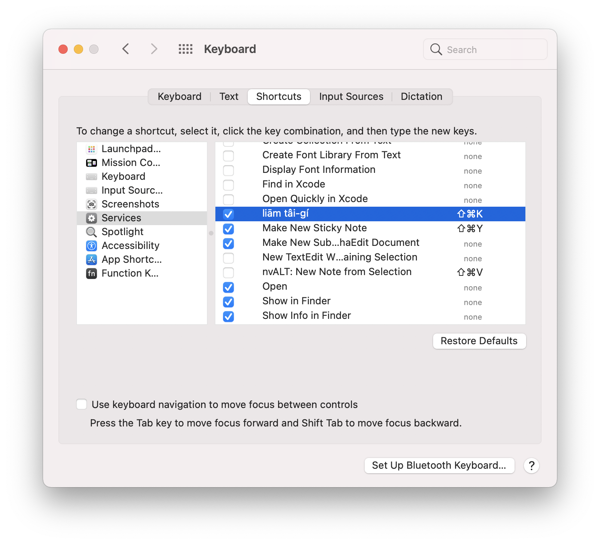
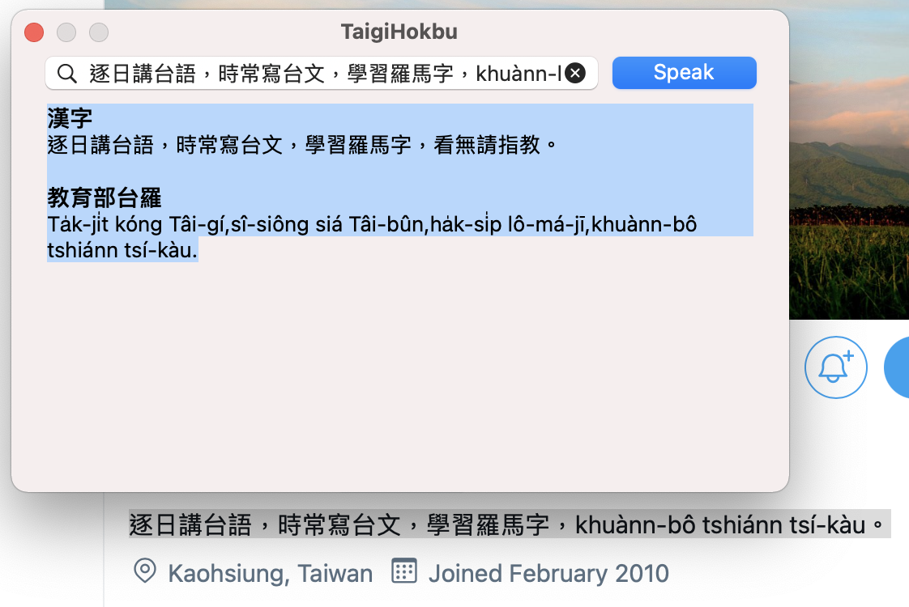

  

# 台語服務

提供macOS方便的使用方式，利用意傳科技開發的[鬥拍字](https://suisiann.ithuan.tw)網站，將選取的台語文字唸出來。

## 使用方式

1. 打開台語服務
2. 在 System Preferences > Keyboard > Shortcuts > Services 內，找到「liām Tâi-gí」，勾起來。 
3. 在 macOS 內選取台文，按 Cmd-Shift-K 或右鍵選 Services 選單，找「liām Tâi-gí」，就會上鬥拍字網站念台語給你聽。 

## TODO

- 加入 itaigi 和 chhoe taigi
- 加入台語資源網站 link
